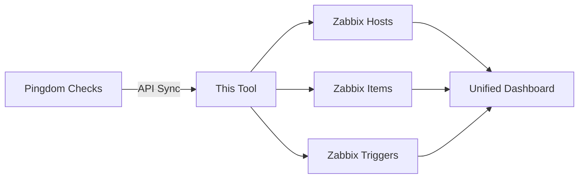

<div align="center">

# 🔗 Pingdom-To-Zabbix Integration

**Automates the integration of Pingdom uptime checks into Zabbix for centralized infrastructure monitoring.**

[](https://opensource.org/licenses/MIT)
[](https://www.python.org/)
[](https://github.com/NexteraMatt/Pingdom-To-Zabbix/graphs/commit-activity)

[Features](#-features) • [Installation](#-installation) • [Usage](#-usage) • [Documentation](#-how-it-works)

</div>

---

## 🎯 The Problem

Teams using both Pingdom (for external uptime monitoring) and Zabbix (for internal infrastructure monitoring) face several challenges:

| Challenge | Impact |
|-----------|--------|
| 🔄 **Context switching** | Engineers must check multiple systems to correlate data |
| 📋 **Duplicate effort** | Maintaining check configurations in two separate systems |
| 🔔 **Alert fatigue** | Separate alerting systems create noise and delays |
| 👁️ **Incomplete visibility** | No single source of truth for overall system health |

---

## ✨ The Solution

This tool automatically syncs Pingdom checks into Zabbix via API, creating:



Engineers can now see Pingdom uptime data alongside internal metrics in a single Zabbix dashboard, improving incident response and reducing context switching.

---

## 🚀 Features

<table>
<tr>
<td width="50%">

### Core Functionality
- ✅ **Idempotent sync** - Safely re-run without duplicates
- 🏗️ **Automatic host creation** - Dynamic Zabbix hosts
- 📊 **Status tracking** - Monitor up/down and response times
- 🎯 **Trigger automation** - Set up alerting automatically
- 🗂️ **Clear mapping** - Organized host groups and templates
- 🔌 **API-driven** - Uses official Pingdom & Zabbix APIs

</td>
<td width="50%">

### Benefits
- ⚡ **Faster incident response** - Single pane of glass
- 🔕 **Reduced alert fatigue** - Unified alerting
- 🔍 **Better correlation** - External + internal metrics
- 📈 **Single source of truth** - Zabbix as central hub
- 🤖 **Full automation** - No manual maintenance

</td>
</tr>
</table>

---

## 📋 Prerequisites

```bash
✓ Python 3.x
✓ Pingdom API access (API key, username, password)
✓ Zabbix server with API access
✓ requests Python library
```

---

## 🔧 Installation

**1️⃣ Clone the repository**
```bash
git clone https://github.com/NexteraMatt/Pingdom-To-Zabbix.git
cd Pingdom-To-Zabbix
```

**2️⃣ Install dependencies**
```bash
pip install requests
```

**3️⃣ Configure API credentials** (see [Configuration](#⚙️-configuration) section)

---

## ⚙️ Configuration

Create a configuration file with your API credentials:

```ini
[pingdom]
app_key = your_pingdom_app_key
username = your_pingdom_email
password = your_pingdom_password

[zabbix]
server = https://your-zabbix-server/api_jsonrpc.php
username = your_zabbix_username
password = your_zabbix_password
```

> 💡 **Tip:** Keep this file secure and never commit it to version control. Add it to `.gitignore`.

---

## 🎮 Usage

### Manual Execution

```bash
python pingdom_to_zabbix.py
```

### Automated Scheduling (Recommended)

Add to crontab for regular syncing:

```bash
# Run every 15 minutes
*/15 * * * * /usr/bin/python3 /path/to/pingdom_to_zabbix.py
```

---

## 🔄 How It Works

```
┌─────────────────┐
│ 1. Fetch Checks │  Retrieves all active checks from Pingdom API
└────────┬────────┘
         │
         ▼
┌─────────────────┐
│ 2. Create Hosts │  For each check, creates or updates a Zabbix host
└────────┬────────┘
         │
         ▼
┌─────────────────┐
│ 3. Setup Items  │  Configures items to track status and response time
└────────┬────────┘
         │
         ▼
┌─────────────────┐
│ 4. Add Triggers │  Creates triggers for down/degraded status alerts
└────────┬────────┘
         │
         ▼
┌─────────────────┐
│ 5. Push Values  │  Updates current check status and response times
└─────────────────┘
```

---

## 💪 Benefits

<div align="center">

| Benefit | Before | After |
|---------|--------|-------|
| **Incident Response Time** | Check 2+ systems | Single dashboard view |
| **Alert Management** | Duplicate alerts from both systems | Unified alerting in Zabbix |
| **Data Correlation** | Manual correlation required | Automatic correlation |
| **System Maintenance** | Manage 2 separate platforms | Single platform maintenance |

</div>

---

## 🛠️ Stack

<p align="center">
  
  
  
</p>

---

## 🤝 Contributing

Contributions are welcome! Please:

- ✅ Code follows PEP 8 style guidelines
- ✅ Changes are tested against both Pingdom and Zabbix APIs
- ✅ Documentation is updated for new features
- ✅ Pull requests include clear descriptions

---

## 📄 License

This project is licensed under the MIT License - see the [LICENSE](LICENSE) file for details.

---

## 🙏 Acknowledgments

Built to solve real operational challenges in managing distributed monitoring infrastructure.

---

## 📬 Support

<div align="center">

**Need help or found a bug?**

[](https://github.com/NexteraMatt/Pingdom-To-Zabbix/issues)

[Open an Issue](https://github.com/NexteraMatt/Pingdom-To-Zabbix/issues) • [Visit Portfolio](https://matthodges.uk)

</div>

---

<div align="center">

**Made with ❤️ by [Matt Hodges](https://matthodges.uk)**

⭐ Star this repo if you find it useful!

</div>
